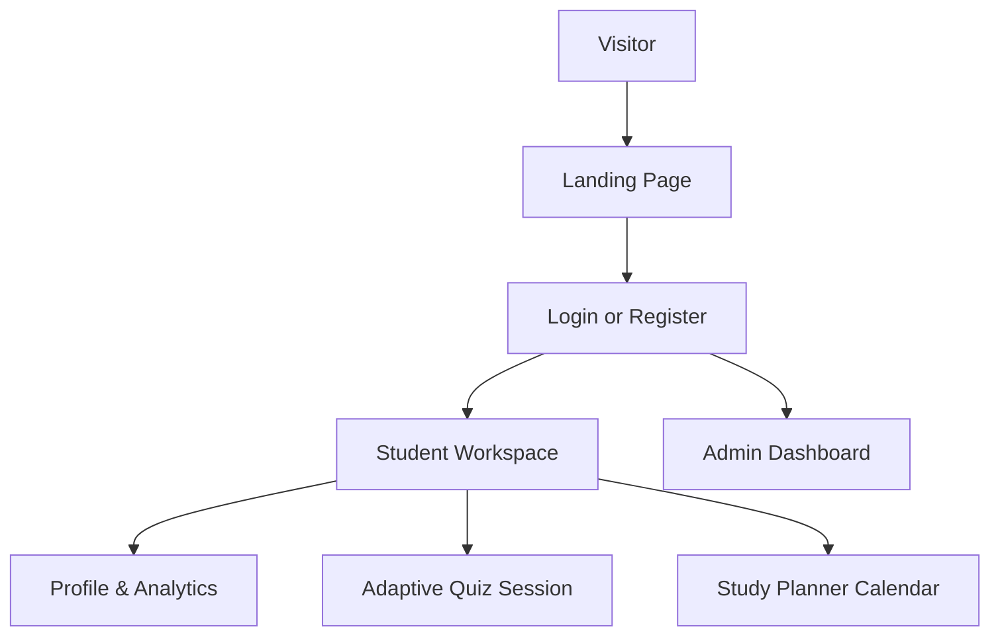
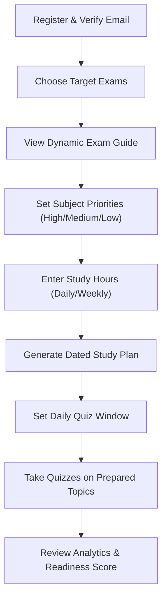
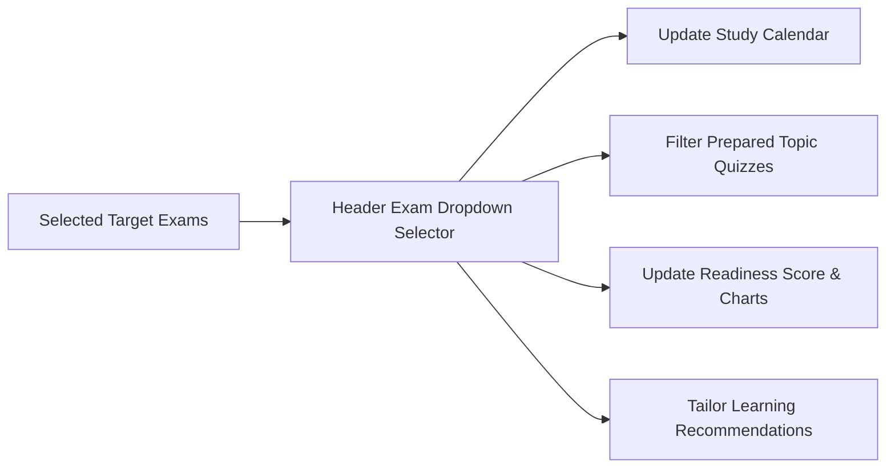
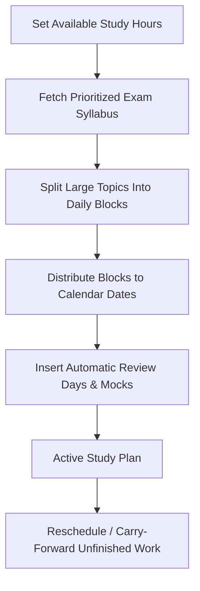
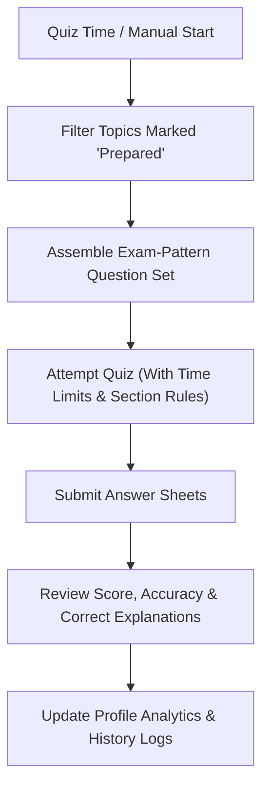
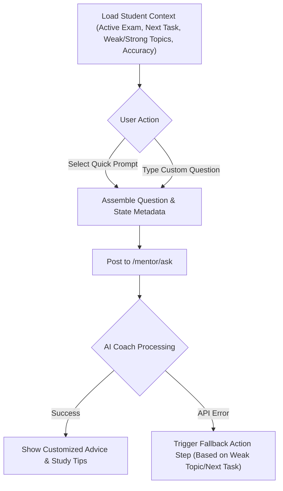
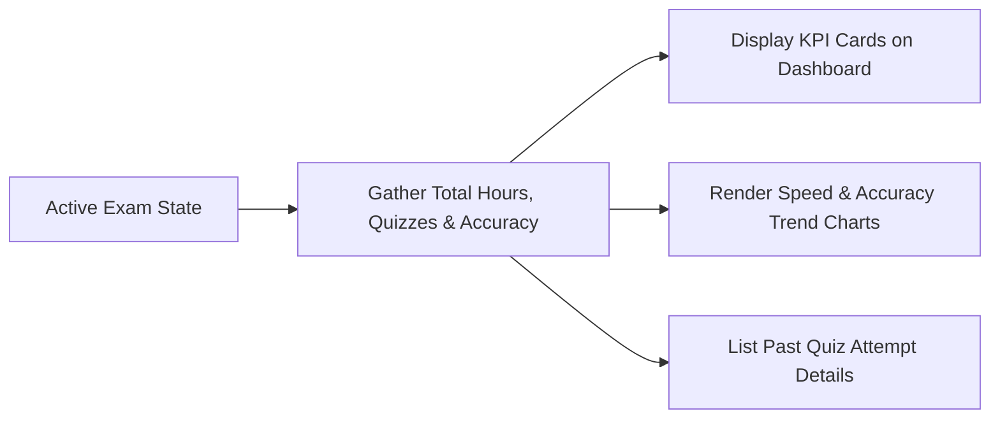
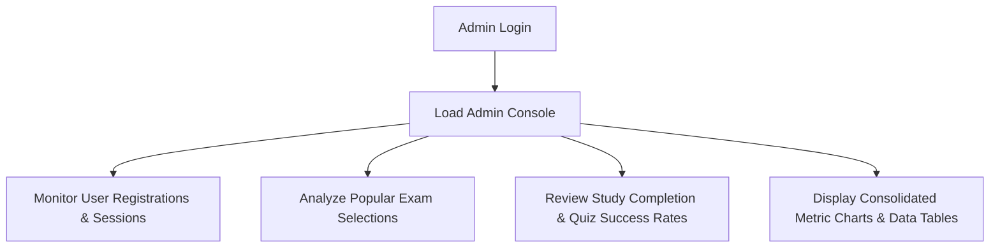
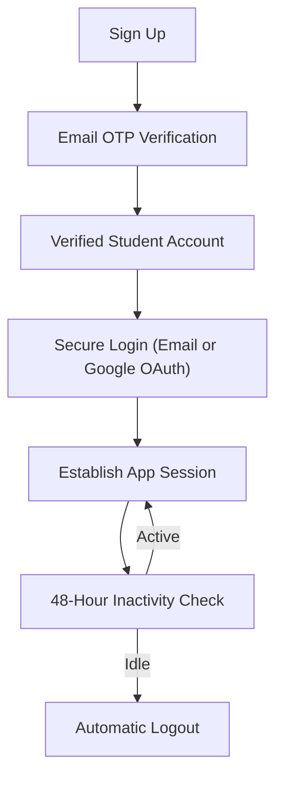

# SK Quiz Coach

SK Quiz Coach is an adaptive exam preparation platform designed for students preparing for competitive exams. It helps learners select target exams, understand their structure, prioritize syllabus subjects, generate a realistic dated study plan based on available time, schedule quizzes, attempt exam-pattern questions, and track overall readiness.

---

## Overview

| Area                | Product Details                                                                                     |
| ------------------- | --------------------------------------------------------------------------------------------------- |
| **Product Name**    | SK Quiz Coach                                                                                       |
| **Primary User**    | Competitive exam aspirants (e.g., Civil Services, Engineering, Medical, Banking, or custom entries) |
| **Main Outcome**    | Date-wise personalized study schedules and adaptive topic quizzes                                   |
| **Exam Support**    | Dynamic setup for any exam configured by the user                                                   |
| **Personalization** | Tailored recommendations based on study pacing, section priorities, and topic accuracy              |
| **Key Portals**     | Student Workspace, Parent/Mentor View, Admin Dashboard                                              |

---

## Table of Contents

1. [User Roles](#user-roles)
2. [Student Flow](#student-flow)
3. [Exam Selection Flow](#exam-selection-flow)
4. [Study Planner Flow](#study-planner-flow)
5. [Quiz Flow](#quiz-flow)
6. [Mentor Flow](#mentor-flow)
7. [Profile and Analytics Flow](#profile-and-analytics-flow)
8. [Admin Flow](#admin-flow)
9. [Authentication Flow](#authentication-flow)
10. [Key Features](#key-features)

---

## User Roles

### Purpose

To customize the platform experience based on the permissions and objectives of the signed-in user.

### Flowchart

---

## Student Flow

### Purpose

To guide a student from their first registration to their daily exam preparation activities.

### Flowchart

---

## Exam Selection Flow

### Purpose

To keep all sections of the workspace (study plan, quiz bank, progress metrics, mentor feedback) focused on the student's active exam goals.

### Flowchart

---

## Study Planner Flow

### Purpose

To generate a realistic date-by-date study calendar based on the student's available daily/weekly time rather than over-scheduling static topics.

### Flowchart

---

## Quiz Flow

### Purpose

To test the student's knowledge using official exam-pattern questions solely covering the syllabus sections they have marked as prepared.

### Flowchart

---

## Mentor Flow

### Purpose

To provide personalized, AI-powered study coaching, revision strategies, and concept explanations based on the student's active exam, upcoming calendar tasks, and weak/strong topics.

### Flowchart

---

## Profile and Analytics Flow

### Purpose

To serve as the student's command center, tracking overall learning consistency, accuracy, and readiness forecasts.

### Flowchart

---

## Admin Flow

### Purpose

To give administrators full visibility into platform engagement, exam demand, and overall student activity.

### Flowchart

---

## Authentication Flow

### Purpose

To keep user session credentials secure, verify account registration, and automatically terminate idle sessions.

### Flowchart

---

## Key Features

- **Multi-Exam Capability:** Students can enroll in and target multiple exams concurrently, switching active views instantly.
- **Flexible Study Planner:** Planners dynamically adjust to input daily/weekly study hours, automatically break down heavy subjects, schedule mock reviews, and support rescheduling.
- **Adaptive Quiz Engine:** Quizzes only assess prepared topics and mimic real exam standards (like time limits, match-following structures, and negative marking).
- **Comprehensive Performance Reports:** Explanations and accuracy mapping are delivered immediately after quiz completion.
- **Student Dashboard & Progress Analytics:** Visual command center displaying completed study hours, quiz accuracy history, and exam readiness scores.
- **Interactive AI Mentor:** Context-aware study coaching that answers dynamic preparation questions based on active progress logs and schedules.
- **Secure Authentication:** Sessions are secured with Google Sign-in integration, OTP confirmations, and inactive session timeouts.
