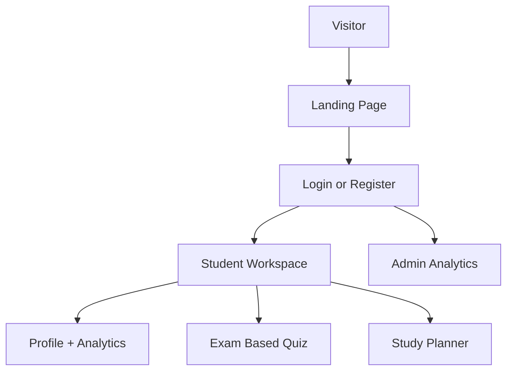
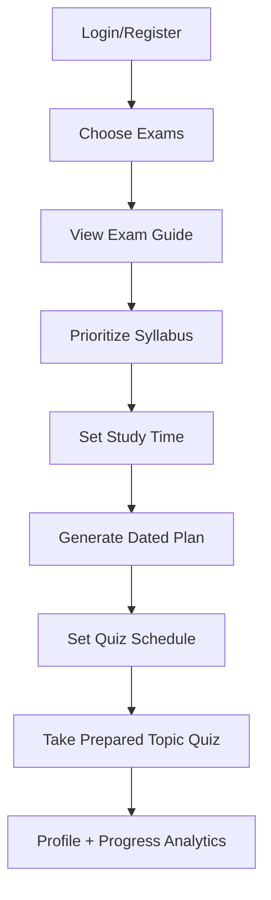
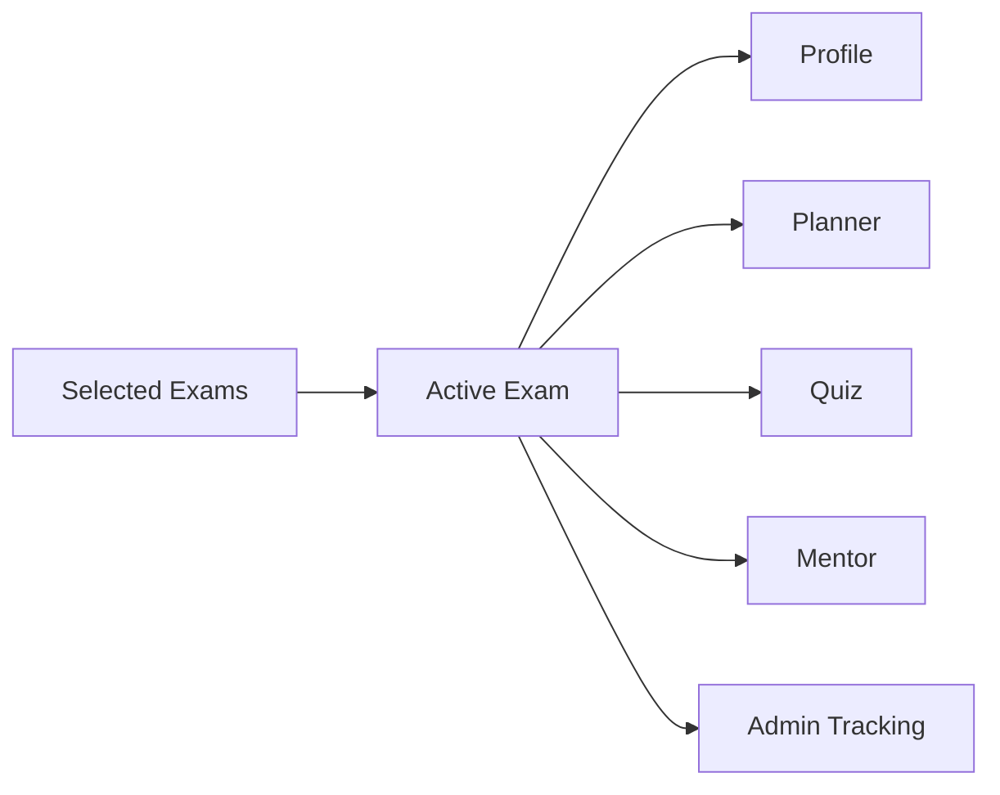
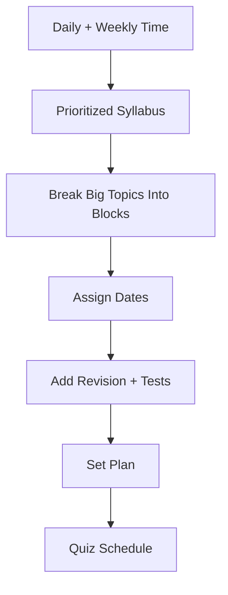
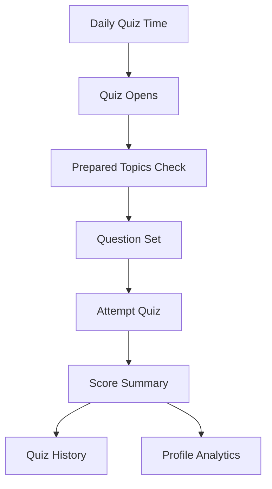
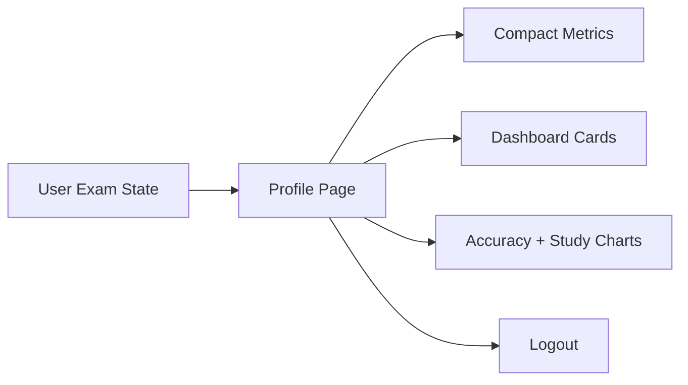
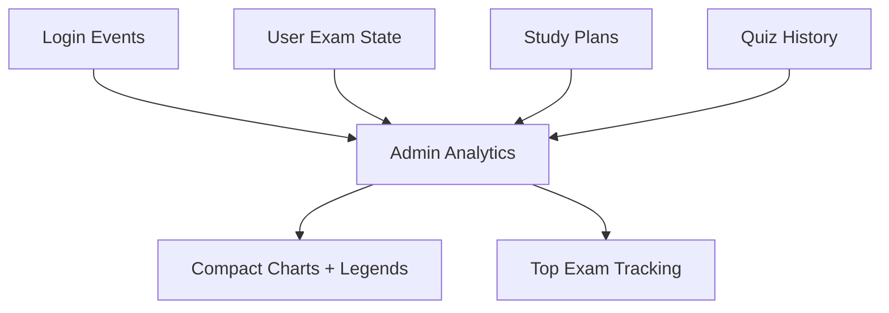
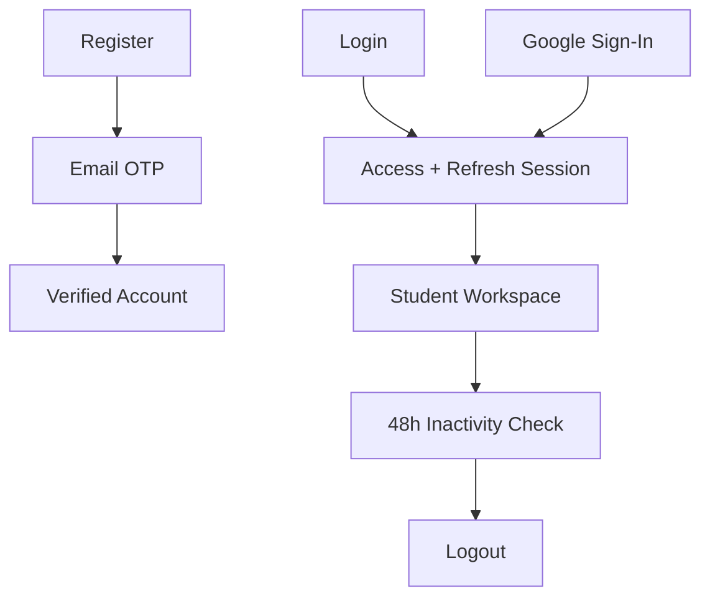
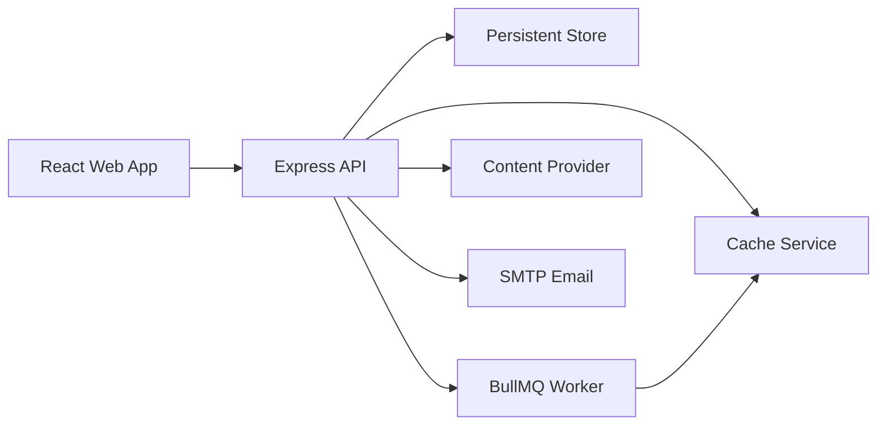
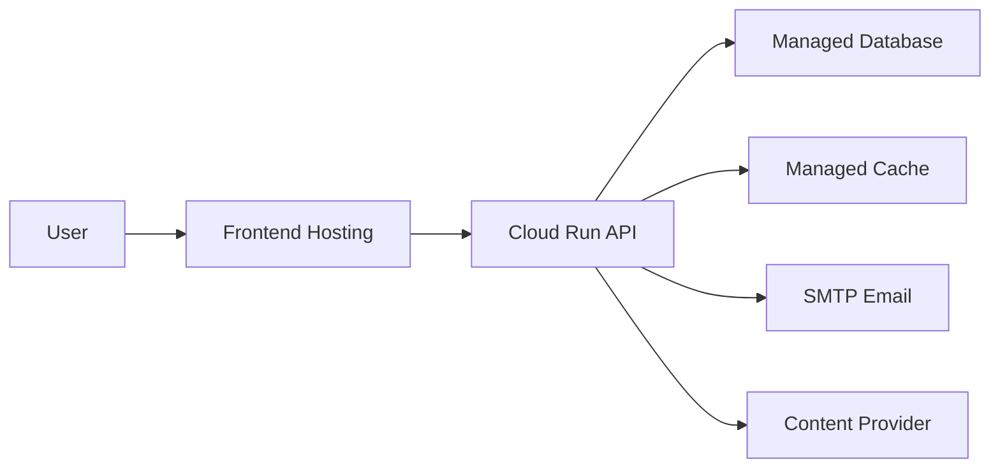

# SK Quiz Coach

SK Quiz Coach is an adaptive exam preparation platform for students preparing for competitive exams. It helps a learner choose one or more exams, understand the exam structure, prioritize subjects, build a realistic dated study plan, schedule quizzes, attempt exam-pattern questions, and track progress by exam.

The project is built as a full-stack TypeScript monorepo with a React web app, Express API, persistent storage, cache-backed jobs, scheduled quizzes, authentication, admin analytics, and an adaptive exam and quiz generation layer.

## Table of Contents

1. [Overview](#overview)
2. [User Roles](#user-roles)
3. [Student Flow](#student-flow)
4. [Exam Selection Flow](#exam-selection-flow)
5. [Study Planner Flow](#study-planner-flow)
6. [Quiz Flow](#quiz-flow)
7. [Profile and Analytics Flow](#profile-and-analytics-flow)
8. [Admin Flow](#admin-flow)
9. [Authentication Flow](#authentication-flow)
10. [System Architecture](#system-architecture)
11. [Tech Stack](#tech-stack)
12. [Local Setup](#local-setup)
13. [Deployment](#deployment)

## Overview

| Area | Details |
| --- | --- |
| Product Name | SK Quiz Coach |
| Main User | Competitive exam aspirant |
| Main Outcome | Personalized exam-wise preparation plan and quiz tracking |
| Exam Support | Any exam entered by the user |
| Personalization | User based and exam based |
| Core Modules | Landing, Auth, Onboarding, Exam Guide, Planner, Quiz, Profile, Mentor, Admin |
| Data Storage | Persistent app data plus jobs/cache |
| Deployment Target | Cloud Run API, Vercel/Firebase frontend, managed database, managed cache |

## User Roles

### Purpose

Define how each user experiences the platform.

### Work

| User | What They Can Do |
| --- | --- |
| Visitor | View landing page, understand product, login or register |
| Student | Select exams, view guides, set priorities, build plans, take quizzes, track progress |
| Admin | Monitor user activity, exam demand, login trends, study plans, and quiz completion |

### Flowchart



## Student Flow

### Purpose

Guide a student from first login to daily exam preparation.

### Work

1. User registers and verifies email with OTP.
2. User chooses one or more target exams.
3. Platform creates a detailed exam guide.
4. User prioritizes subjects and syllabus sections.
5. User enters daily and weekly study time.
6. Platform builds a dated plan.
7. User schedules daily quiz time.
8. Quiz questions are generated from prepared topics.
9. Profile page shows progress, study hours, readiness, and analytics.

### Flowchart



## Exam Selection Flow

### Purpose

Keep every part of the product tied to the user’s active exam.

### Work

- The topbar exam selector stores the active exam.
- Profile, planner, quiz, analytics, and mentor views read the same active exam.
- If the user switches from one exam to another, the whole product updates for that exam.
- The topbar shows compact exam initials, while the dropdown shows full exam names.

### Flowchart



## Study Planner Flow

### Purpose

Create a practical plan based on available time instead of unrealistic topic dumping.

### Work

- User provides start date, daily study hours, weekly study hours, and quiz time.
- Large topics are split across multiple days.
- Revision and mock tasks are inserted.
- Unfinished tasks can be carried forward.
- The user can edit the plan before setting it.

### Flowchart



## Quiz Flow

### Purpose

Ask questions only from the selected exam and prepared topics.

### Work

- Upcoming quiz is based on the active exam and current study-plan task.
- Questions follow exam pattern, marking rules, section timing, and prepared topic scope.
- Scheduled quizzes open at the configured time.
- Quiz result summary records score, accuracy, time, and topic performance.
- Old attempts appear in quiz history.

### Flowchart



## Profile and Analytics Flow

### Purpose

Make the profile page the student’s compact command center.

### Work

- Shows active exam, daily hours, weekly hours, quiz time, completed quizzes, and plan hours.
- Contains dashboard widgets.
- Contains accuracy and study-time charts.
- Provides logout.
- Works on small screens with compact cards and bottom navigation.

### Flowchart



## Admin Flow

### Purpose

Help the admin understand how the product is being used.

### Work

Admin can analyze:

- Total users.
- Login and verification events.
- Exam demand.
- Daily, weekly, monthly, and yearly tracking.
- Planned study hours.
- Quiz completion.
- Top tracked exams.

### Flowchart



## Authentication Flow

### Purpose

Protect user data and keep sessions secure.

### Work

- Email registration.
- OTP email verification.
- Email login.
- Google sign-in.
- Forgot password with OTP.
- Refresh token support.
- Manual logout.
- Automatic logout after 48 hours of inactivity.

### Flowchart



## System Architecture

### Purpose

Separate frontend, backend, database, jobs, and background services cleanly.

### Work

- React web app handles user experience.
- Express API handles business logic.
- Persistent storage keeps users, exams, plans, quizzes, and analytics.
- The cache service supports queues, caching, and scheduling.
- Background workers prepare scheduled quiz content.
- External content provider supports exam discovery and question generation.

### Flowchart



## Tech Stack

| Layer | Stack |
| --- | --- |
| Frontend | React 19, TypeScript, Vite, Tailwind CSS, TanStack Router, Zustand, Axios, Framer Motion, GSAP, Recharts, Lucide |
| Backend | Node.js, TypeScript, Express, Mongoose, JWT, Socket.IO |
| Database | Persistent document store |
| Queue/Cache | Cache service, BullMQ |
| Auth | Email OTP, Google Sign-In, JWT access/refresh tokens |
| Email | SMTP mailbox, optional API email provider |
| Deployment | Cloud Run API, Vercel/Firebase frontend, managed database, managed cache |

## Local Setup

### Prerequisites

Ensure you have the following installed on your machine:
- **Node.js**: v22.x (LTS recommended)
- **npm**: v10.x or newer
- **Docker Desktop**: Required to orchestrate database and cache services.

### Environment Configuration

1. **Backend Configuration**:
   Copy the backend example env file to create your local env file:
   ```bash
   cp apps/api/.env.example apps/api/.env.local
   ```
   Fill in the required keys, especially:
   - `GEMINI_API_KEY`: Your Google Gemini API Key for adaptive question generation.
   - `MONGODB_URI`: Defaults to `mongodb://127.0.0.1:27018/sk-quiz-coach` (mapped via Docker).
   - `REDIS_URL`: Defaults to `redis://127.0.0.1:6380` (mapped via Docker).

2. **Frontend Configuration**:
   Copy the frontend example env file to create your local env file:
   ```bash
   cp apps/web/.env.example apps/web/.env.local
   ```
   - `VITE_API_URL`: Defaults to `http://localhost:4001/api` (points to local backend port).

### Running Locally

To boot up the complete full-stack environment with a single command:

1. **Install dependencies**:
   ```bash
   npm install
   ```

2. **Start the local stack**:
   ```bash
   npm run dev
   ```

The dev launcher script (`scripts/dev.mjs`) automatically:
- Launches Docker Desktop (if on Windows) and starts the MongoDB and Redis containers via Docker Compose.
- Health-checks the database and cache ports.
- Spawns the REST & WebSocket backend Express API on `http://localhost:4001` (hot-reloads with `tsx watch`).
- Builds and runs the frontend Vite app preview server on `http://localhost:5474`.

### Development Tasks

- **Format Code**: `npm run format`
- **Lint Code**: `npm run lint`
- **Typecheck**: `npm run typecheck`
- **Run Tests**: `npm run test`
- **Build Services**: `npm run build`

## Deployment


### Purpose

Deploy without slow backend cold starts.

### Work

Recommended cloud setup:

| Service | Recommendation |
| --- | --- |
| Frontend | Vercel or Firebase Hosting |
| Backend | Google Cloud Run with minimum instances |
| Database | Managed document database |
| Cache | Managed cache service |
| Email | GoDaddy SMTP or production SMTP provider |

### Flowchart


