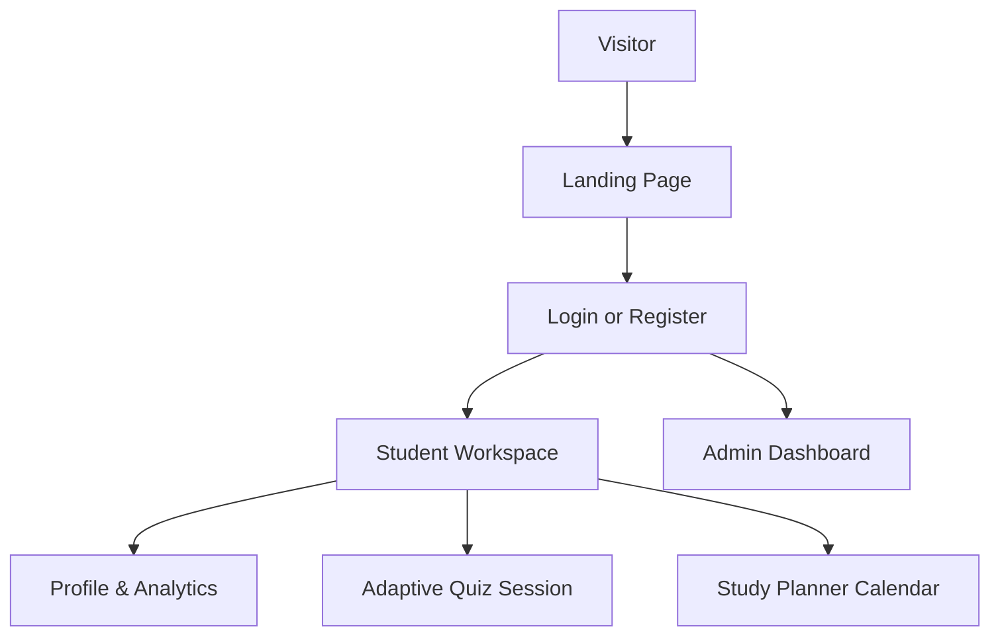
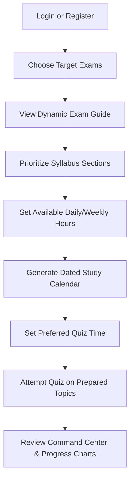

# SK Quiz Coach

SK Quiz Coach is an adaptive exam preparation platform designed for students preparing for competitive exams. It helps learners select target exams, understand their structure, prioritize syllabus subjects, generate a realistic dated study plan based on available time, schedule quizzes, attempt exam-pattern questions, and track overall readiness.

The platform acts as a smart preparation coach that dynamically adapts to each student's pace, study calendar, and learning objectives.

---

## Table of Contents

1. [Product Overview](#product-overview)
2. [User Roles](#user-roles)
3. [Student Onboarding Flow](#student-onboarding-flow)
4. [Core Features](#core-features)
   - [Active Exam Selection](#active-exam-selection)
   - [Personalized Study Planner](#personalized-study-planner)
   - [Adaptive Quiz Engine](#adaptive-quiz-engine)
   - [Student Command Center & Analytics](#student-command-center--analytics)
   - [Admin Analytics Portal](#admin-analytics-portal)
5. [Authentication & Security](#authentication--security)

---

## Product Overview

| Area | Product Details |
| --- | --- |
| **Product Name** | SK Quiz Coach |
| **Primary User** | Competitive exam aspirants (e.g., Civil Services, Engineering, Medical, Banking, or custom entries) |
| **Main Outcome** | Date-wise personalized study schedules and adaptive topic quizzes |
| **Exam Support** | Dynamic setup for any exam configured by the user |
| **Personalization** | Tailored recommendations based on study pacing, section priorities, and topic accuracy |
| **Key Portals** | Student Workspace, Parent/Mentor View, Admin Dashboard |

---

## User Roles

SK Quiz Coach customizes the platform experience based on the role of the signed-in user:

* **Visitor:** Can view the informational landing page, explore the platform's core benefits, and sign up or log in.
* **Student:** Can configure their target exams, review exam guides, set topic priorities, generate study plans, take customized quizzes, review reports, and check progress charts.
* **Admin:** Can monitor overall platform engagement, user registration rates, popular exam selections, and quiz completion metrics.

### Workspace Flow

---

## Student Onboarding Flow

To help students kickstart their preparation, the platform guides them through a step-by-step setup:

1. **Registration & Security:** Sign up with your email and verify your account.
2. **Exam Selection:** Select one or more competitive exams you are actively preparing for.
3. **Dynamic Guide:** The platform compiles a comprehensive guide detailing exam mode, timing, mark allocation, and official syllabus.
4. **Syllabus Prioritization:** Mark subjects or syllabus segments as High, Medium, or Low priority based on your comfort level.
5. **Study Hour Setup:** Input the number of hours you can realistically study each day and week.
6. **Dated Calendar Generation:** The coach builds a daily, date-by-date syllabus plan indicating exactly which topics to study.
7. **Quiz Scheduling:** Choose your daily test window to establish a consistent practice habit.
8. **Targeted Quizzing:** Take short practice quizzes consisting of questions from topics you have marked as prepared.
9. **Dashboard Review:** View your speed, accuracy, and overall readiness scores.

---

## Core Features

### Active Exam Selection
* **Multi-Exam Tracking:** Students can register for and track multiple exams concurrently.
* **Instant Workspace Switch:** Changing the active exam in the header instantly updates the study planner, quizzes, analytics, mentor guides, and practice tests to match that exam's profile.
* **Visual Clarity:** Displays clean, recognizable exam tags and dropdown lists for easy switching.

### Personalized Study Planner
* **Time-Based Scheduling:** Unlike static planners that simply dump list items onto dates, SK Quiz Coach breaks up your syllabus based on the study hours you have available.
* **Automatic Topic Partitioning:** Large, heavy subjects are split into manageable daily chunks.
* **Built-in Review Windows:** Automatically schedules periodic revision days and mock tests.
* **Dynamic Carry-Forward:** Easily rescheduling or moving incomplete daily tasks forward keeps your study calendar realistic.

### Adaptive Quiz Engine
* **Prepared Topic Focus:** Quizzes ask questions only from the sections you have marked as prepared, making testing productive and relevant.
* **Real Exam Simulation:** Follows official exam patterns, section timers, question formats (such as multiple-choice, numerical, or match-following), and marking rules (including negative marks).
* **Comprehensive Performance Reports:** Shows immediate scores, correct answer explanations, accuracy analytics, and subject-level recommendations after each quiz.
* **History Log:** Stores past quiz attempts so you can review errors and track long-term trends.

### Student Command Center & Analytics
* **Key Performance Metrics:** Tracks total study hours completed, average quiz accuracy, number of quizzes taken, and estimated exam readiness.
* **Visual Progress Charts:** Interactive line and bar graphs track consistency, average answer speed, and accuracy trends over time.
* **Responsive Layout:** Designed to work perfectly on tablets, smartphones, and desktop computers.

### Admin Analytics Portal
* **Global Activity Summary:** Monitors total registered users and active daily study sessions.
* **Demand Analytics:** Identifies which competitive exams are most popular among users.
* **Success Trackers:** Tracks system-wide quiz completion rates and aggregate score metrics to help manage platform content.

---

## Authentication & Security

* **Secure Registration:** Email verification using secure One-Time Passcodes (OTP).
* **Easy Access:** Login via email credentials or single-click Google Sign-In.
* **Credential Recovery:** Password reset flow backed by email authentication codes.
* **Idle-Session Timeout:** Automatic logouts occur after 48 hours of inactivity to keep your study data private, even on shared devices.
