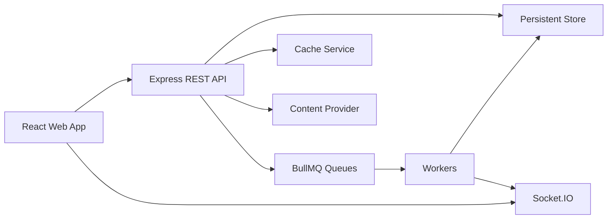
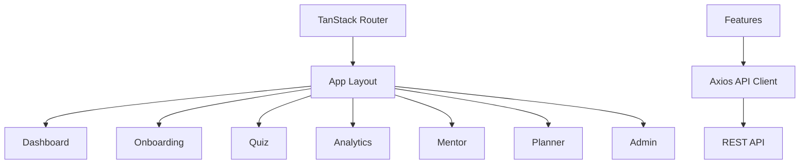

# Architecture

SK Quiz Coach uses a feature-based monorepo that separates product surfaces from domain services.

## Backend

Controllers only translate HTTP requests into service calls. Services own business behavior. Repositories isolate persistence access where the domain benefits from a boundary. Mongoose models represent the normalized collection design requested in the product brief.

Important API directories:

- `config`: environment, cache, provider configuration.
- `controllers`: thin HTTP handlers.
- `routes`: REST route composition.
- `middlewares`: auth, validation, request context, error handling.
- `models`: Mongoose schemas.
- `services`: auth, exam onboarding, quiz logic.
- `provider`: prompts, prompt versions, response validation.
- `jobs` and `workers`: BullMQ scheduling.
- `socket`: realtime notifications and session events.

## Frontend

The web app uses TanStack Router for route ownership, TanStack Query for server state, Zustand for client session state, and feature folders for product areas.

## Content Layer

The content integration is intentionally isolated behind a provider service. The service handles prompt rendering, versioning, response parsing, retries, cache lookup, token/log placeholders, and domain-specific validation before persistence.
