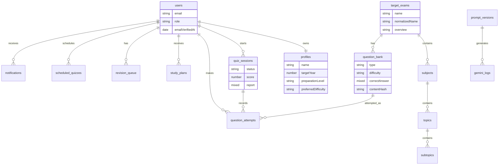

# ER Diagram

```mermaid
erDiagram
  users ||--|| profiles : owns
  users ||--o{ quiz_sessions : starts
  users ||--o{ question_attempts : makes
  users ||--o{ study_plans : receives
  users ||--o{ revision_queue : has
  users ||--o{ scheduled_quizzes : schedules
  users ||--o{ notifications : receives
  target_exams ||--o{ subjects : contains
  subjects ||--o{ topics : contains
  topics ||--o{ subtopics : contains
  target_exams ||--o{ question_bank : has
  quiz_sessions ||--o{ question_attempts : records
  question_bank ||--o{ question_attempts : attempted_as
  prompt_versions ||--o{ gemini_logs : generates

  users {
    string email
    string role
    date emailVerifiedAt
  }
  profiles {
    string name
    number targetYear
    string preparationLevel
    string preferredDifficulty
  }
  target_exams {
    string name
    string normalizedName
    string overview
  }
  question_bank {
    string type
    string difficulty
    mixed correctAnswer
    string contentHash
  }
  quiz_sessions {
    string status
    number score
    mixed report
  }
```
